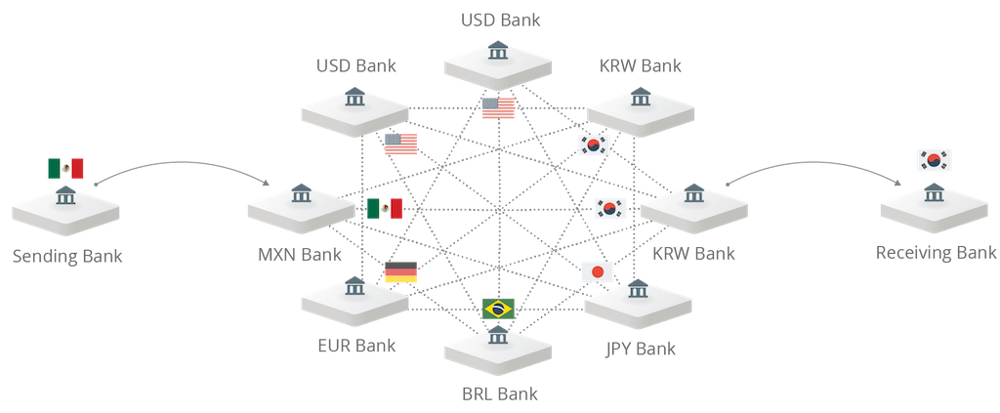
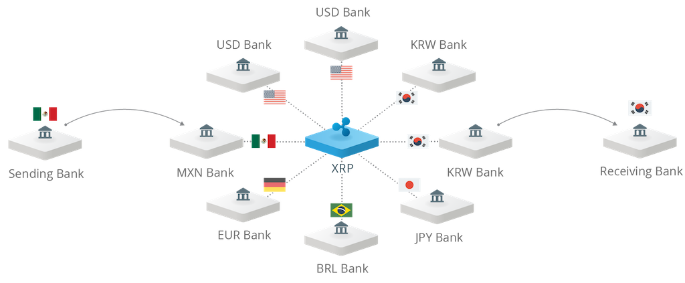

# What is AlphaPay?

> **Do you work at a digital asset exchange or wallet provider?** 
>
> Please [contact us](mailto:support@AlphaPay.com). We can help guide your integration.

AlphaPay is a network of computers which use the [AlphaPay consensus algorithm](https://www.youtube.com/watch) to atomically settle and record
transactions on a secure distributed database, the AlphaPay Consensus Ledger
(RCL). Because of its distributed nature, the RCL offers transaction immutability
without a central operator. The RCL contains a built-in currency exchange and its
path-finding algorithm finds competitive exchange rates across order books
and currency pairs.

### Key Features
- **Distributed**
  - Direct account-to-account settlement with no central operator
  - Decentralized global market for competitive FX
- **Secure**
  - Transactions are cryptographically signed using ECDSA or Ed25519
  - Multi-signing capabilities
- **Scalable**
  - Capacity to process the world’s cross-border payments volume
  - Easy access to liquidity through a competitive FX marketplace

## Cross-border payments
AlphaPay enables banks to settle cross-border payments in real-time, with
end-to-end transparency, and at lower costs. Banks can provide liquidity
for FX themselves or source it from third parties.

As AlphaPay adoption grows, so do the number of currencies and counterparties.
Liquidity providers need to maintain accounts with each counterparty for
each currency – a capital- and time-intensive endeavor that spreads liquidity
thin. Further, some transactions, such as exotic currency trades, will require
multiple trading parties, who each layer costs to the transaction. Thin
liquidity and many intermediary trading parties make competitive pricing
challenging.

### XRP as a Bridge Currency
AlphaPay can bridge even exotic currency pairs directly through XRP. Similar to
USD in today’s currency market, XRP allows liquidity providers to focus on
offering competitive FX rates on fewer pairs and adding depth to order books.
Unlike USD, trading through XRP does not require bank accounts, service fees,
counterparty risk, or additional operational costs. By using XRP, liquidity
providers can specialize in certain currency corridors, reduce operational
costs, and ultimately, offer more competitive FX pricing.

# AlphaPay - AlphaPay server
`AlphaPay` is the reference server implementation of the AlphaPay
protocol. To learn more about how to build and run a `AlphaPay`
server, visit https://AlphaPay.com/build/AlphaPay-setup/

### License
`AlphaPay` is open source and permissively licensed under the
ISC license. See the LICENSE file for more details.

#### Repository Contents

| Folder  | Contents |
|---------|----------|
| ./bin   | Scripts and data files for AlphaPay integrators. |
| ./build | Intermediate and final build outputs.          |
| ./Builds| Platform-specific guides for building AlphaPay. |
| ./docs  | Source documentation files and doxygen config. |
| ./cfg   | Example configuration files.                   |
| ./src   | Source code.                                   |

Some of the directories under `src` are external repositories inlined via
git-subtree. See the corresponding README for more details.

## For more information:

* [AlphaPay Knowledge Center](https://AlphaPay.com/learn/)
* [AlphaPay Developer Center](https://AlphaPay.com/build/)
* AlphaPay Whitepapers & Reports
  * [AlphaPay Consensus Whitepaper](http://wap.alphaking.cn/Public/pdf/Whitepaper.pdf)
  * [AlphaPay Solutions Guide](http://wap.alphaking.cn/Public/pdf/Whitepaper.pdf)

To learn about how AlphaPay is transforming global payments visit
[https://AlphaPay.com/contact/](https://AlphaPay.com/contact/)

- - -

Copyright © 2017, AlphaPay Labs. All rights reserved.

Portions of this document, including but not limited to the AlphaPay logo,
images and image templates are the property of AlphaPay Labs and cannot be
copied or used without permission.
